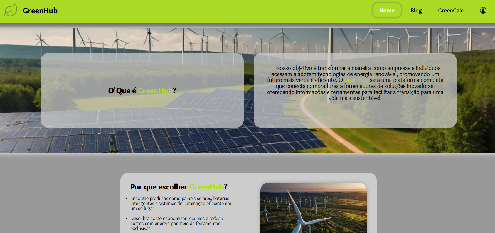

 

# Nome do Projeto

> Global Solution é uma atividade semestral da FIAP que ocorre durante os dois anos do curso de Análise e Desenvolvimento de Sistemas. Essa atividade desafia os alunos a desenvolverem soluções criativas e inovadoras para problemas reais, aplicando os conceitos aprendidos ao longo do curso.

## Tecnologias

## Contexto do Desafio

No primeiro semestre, o tema proposto foi criar um website que ajudasse a resolver os problemas energéticos atuais, promovendo o uso de meios de energia sustentável. A ideia central era trazer uma solução que fosse tecnologicamente viável, sustentável e que tivesse impacto positivo na sociedade.

## A Solução

Minha proposta foi desenvolver um marketplace online dedicado à comercialização de produtos relacionados à energia renovável. Este marketplace visa conectar fabricantes, fornecedores e consumidores interessados em soluções sustentáveis.

### Objetivos do Projeto

* Promover o uso de energia renovável: Tornar acessíveis produtos e tecnologias que favorecem uma matriz energética mais limpa.
* Facilitar a conexão entre vendedores e compradores: Criar um ambiente confiável e amigável para transações comerciais.
* Aumentar a conscientização sobre energia limpa: Disponibilizar conteúdo educativo e informativo sobre o tema no site.

## Contribuir

1. **Clonar projeto:**: `git clone https://github.com/guicarbar/global_solution-fiap-1.git`
2. **Criar feature/branch:**: `git checkout -b feature/Nome-da-branch`

## Observação Importante

O projeto original solicitado pela faculdade deveria ser desenvolvido apenas no Figma. No entanto, decidi ir além e desenvolvê-lo em HTML e CSS por conta própria. Apesar do esforço, não fiquei satisfeito com o resultado final, o que me levou a interromper a criação de outras páginas do projeto. Contudo, pretendo revisitar este tema futuramente e criar um website mais elaborado e bem desenvolvido, que já está na minha lista de futuros projetos.

## Licença

Este projeto está sob a licença [MIT](LICENSE) License.